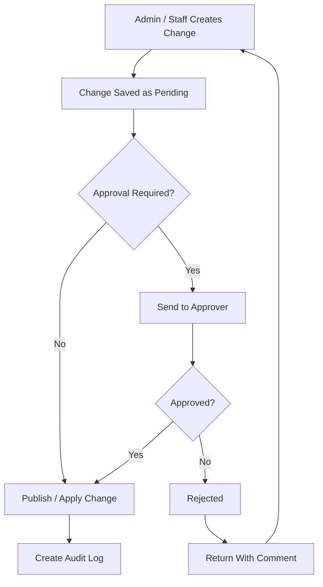
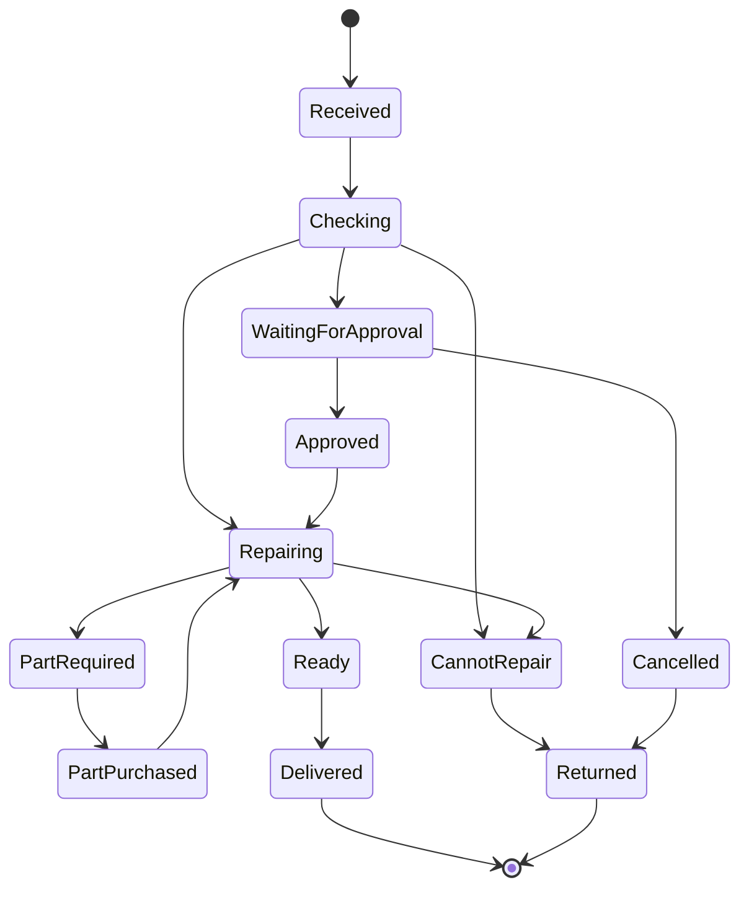
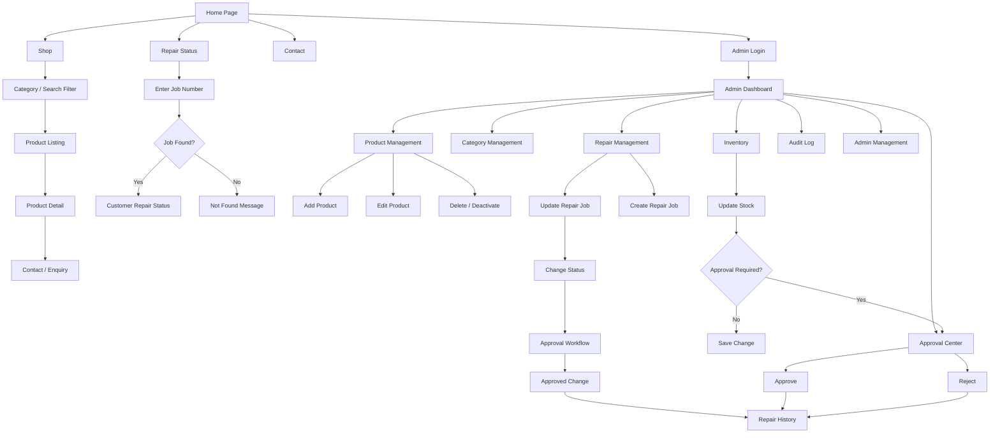

# A to Z Mobile Accessories — Website Project README

## 1. Project Overview

Build a **simple product showcase + repair tracking website** for:

**A to Z Mobile Accessories**

The shop sells:
- Mobile accessories
- Mobile covers
- Tempered glass / screen protectors
- Headphones
- Earbuds
- Spare parts
- Other related mobile/laptop accessories

The shop also provides:
- Mobile repair
- Laptop repair
- Accessory-related repair/service work

The website is **not an e-commerce checkout website**. Customers will use it to view products/services, contact the shop, and track the status of a repair/job.

Shop contact numbers:
- 9958908707
- 9582989669

---

## 2. Design Direction

The uploaded reference image establishes the visual direction.

### Visual style

Use a **classic editorial/product-catalog style** with:
- Large product photography
- Strong split-color sections
- Clean white/off-white content areas
- Elegant typography
- Minimal rounded corners
- Thin borders
- Compact navigation
- Large product title/price areas
- Plenty of whitespace
- Very limited animation

The reference is **not intended to be copied exactly**. It should be used as the inspiration for the color blocking, product presentation, spacing, and overall visual character.

### Reference-inspired palette

Primary colors:

```text
Coral Red:      #F04C52
Deep Teal:      #1B8586
Warm Peach:     #EDB876
Off White:      #F8F5EE
White:          #FFFFFF
Dark Text:      #292725
Muted Text:     #746F68
Border:         #D8D1C5
```

Recommended usage:

```text
Deep Teal  → logo/brand area, secondary navigation, selected labels
Coral Red  → hero sections, strong CTA areas, highlighted product sections
Warm Peach → decorative blocks/background areas
Off White  → primary page background
White      → cards, forms, content panels
Dark Text  → main typography
```

The final UI should feel **premium/classic but still practical for a local mobile-accessories shop**.

---

# 3. Website Goals

There are three core website functions:

### A. Product Showcase
Customers can browse products and services and view details.

### B. Repair Tracking
A customer can enter a **Job Number** and see the current status/details of their repair item.

### C. Admin Management
Authorized admins can manage products, inventory, categories, repairs, and repair status.

---

# 4. User Roles

The system needs multiple admins with approval control.

## Role 1 — Web Owner / Super Admin

The web owner has full system control.

Can:
- Manage all products
- Manage all categories
- Manage inventory
- Add/edit/delete admins
- Manage repair records
- Update repair status
- Approve/reject submitted changes
- View audit/history records
- Configure system settings

## Role 2 — Shop Owner

The shop owner can:
- Manage products
- Manage inventory
- Create/manage repair records
- Update repair information
- Update repair status
- Approve assigned staff changes
- View repair history

## Role 3 — Assigned Admin / Staff

The shop owner can assign up to the required number of staff/admin users.

Assigned staff can:
- Add/update products
- Update inventory
- Create/update repair records
- Update repair status

Their important changes should go through the configured approval process before becoming final.

---

# 5. Approval Workflow

Admin changes should support an approval system.



### Example

A staff member changes:

```text
Repair Job #AZ1008
Status: Checking
        ↓
Status: Repairing
```

The change becomes:

```text
Pending Approval
```

An authorized approver reviews it.

Then:

```text
Approved → Repairing
```

or:

```text
Rejected → Previous status remains active
```

Every important admin action should be recorded in an **audit log**.

---

# 6. Public Website Pages

## Page 1 — Home / Index

Route:

```text
/
```

Main sections:

### Header
- A to Z Mobile Accessories logo/name
- Home
- Shop
- Repair Status
- About
- Contact
- Admin Login

### Hero Section

Use a layout inspired by the uploaded reference:

```text
┌─────────────────────────────────────────────────┐
│ BRAND / NAV                 CONTACT / MENU      │
├─────────────────────────────────────────────────┤
│                                                 │
│  MOBILE ACCESSORIES      LARGE PRODUCT IMAGE    │
│  & REPAIR SERVICES                            │
│                                                 │
│  Short shop description                         │
│  [VIEW SHOP] [CHECK REPAIR]                     │
│                                                 │
├─────────────────────────────────────────────────┤
│                CATEGORY BLOCKS                  │
└─────────────────────────────────────────────────┘
```

### Category Section

Examples:
- Mobile Accessories
- Covers
- Tempered Glass
- Headphones
- Earbuds
- Spare Parts
- Laptop Accessories
- Repair Services

### Featured Products

Show selected products managed by admin.

### Repair Status Section

Prominent search box:

```text
Enter Job Number
[ AZ10001____________ ] [ CHECK STATUS ]
```

### Contact Section
- Phone numbers
- Shop address
- Opening hours
- Contact/enquiry action

---

# 7. Shop Page

Route:

```text
/shop
```

Features:

- Product grid
- Category filter
- Product search
- Optional price sorting
- Optional availability filter
- Product cards
- Pagination/load-more

Example:

```text
SHOP

[ Search products... ]

Categories:
[ ALL ]
[ MOBILE ACCESSORIES ]
[ COVERS ]
[ TEMPERED ]
[ HEADPHONES ]
[ EARBUDS ]
[ SPARE PARTS ]
[ LAPTOP ]

------------------------------------------------

[ PRODUCT ] [ PRODUCT ] [ PRODUCT ] [ PRODUCT ]
[ PRODUCT ] [ PRODUCT ] [ PRODUCT ] [ PRODUCT ]
```

---

# 8. Product Page

Route:

```text
/product/:slug
```

Product page should show:

- Large product image
- Product name
- Category
- Product description
- Price, when applicable
- Availability, when applicable
- Product specifications
- SKU/product code, if configured
- Contact/enquiry button
- Related products

## Inventory Display

Inventory is required, but the public product page must allow the admin to decide whether inventory is displayed.

Product setting:

```text
Show Inventory to Customer: YES / NO
```

Possible public display:

```text
In Stock
Only 3 Left
Out of Stock
Available on Request
```

When this setting is OFF, inventory quantity should stay private to admins.

---

# 9. Repair Status Search Page

Route:

```text
/repair-status
```

The customer only enters the:

```text
JOB NUMBER
```

Example:

```text
Repair Status

Enter your Job Number

[ AZ10027________________ ]

             [ CHECK STATUS ]
```

If found, show customer-safe information.

If not found:

```text
Job number not found.
Please check the number and try again.
```

---

# 10. Customer Repair Result

Example route:

```text
/repair-status/:jobNumber
```

Customer-visible data:

```text
Job Number: AZ10027

Item:
Samsung Galaxy A54

Received:
27 September 2026 — 12:40 PM

Problem Reported:
Charging issue

Current Status:
REPAIRING

Current Condition:
Device opened for charging-port inspection.

Action Being Taken:
Charging port is being checked/repaired.

Estimated Completion:
29 September 2026
```

The customer should **not** see:
- Internal admin notes
- Staff comments
- Private customer information beyond what is needed
- Approval details
- Internal costs
- Admin identity/history unless explicitly configured

---

# 11. Repair Workflow

The repair record needs to capture the full journey of the item.

### Required information

```text
Job Number
Customer Name
Customer Phone
Product / Device Name
Model
Serial Number (optional)
Date & Time Received
Problem Reported
Initial Condition
Current Condition
What Will Be Done
Parts / Accessories Required
Current Status
Expected Completion
Customer Note
Internal Note
```

### Status model

Recommended initial statuses:

```text
RECEIVED
CHECKING
WAITING FOR APPROVAL
APPROVED
REPAIRING
PART / ACCESSORY REQUIRED
PART / ACCESSORY PURCHASED
READY
DELIVERED / COLLECTED
CANNOT REPAIR
RETURNED
CANCELLED
```

This status list can be changed later.

---

# 12. Repair Status Flow



The final business status list should be configured from the shop's actual workflow.

---

# 13. Important Repair Concept

The repair page should separate three things:

### 1. Problem Reported

What the customer says is wrong.

Example:

```text
Phone is not charging.
```

### 2. Current Condition

What the shop currently observes.

Example:

```text
Charging port has visible damage.
```

### 3. Action / Resolution

What the shop is doing.

Example:

```text
Checking port and preparing replacement charging connector.
```

This makes the tracking page much more useful than showing only a single status.

---

# 14. Admin Login

Route:

```text
/admin/login
```

Fields:
- Email / username
- Password

Features:
- Secure authentication
- Session management
- Logout
- Role-based authorization

---

# 15. Admin Dashboard

Route:

```text
/admin
```

Dashboard cards:

```text
Total Products
Active Products
Low Stock
Out of Stock
Open Repairs
Repairing
Waiting for Parts
Ready for Collection
Pending Approvals
```

Also show:
- Recent repair updates
- Recent product changes
- Pending approvals
- Quick action buttons

---

# 16. Product Management

Route:

```text
/admin/products
```

Admin can:

```text
ADD PRODUCT
EDIT PRODUCT
DELETE / DEACTIVATE PRODUCT
SEARCH PRODUCT
FILTER CATEGORY
FILTER STOCK
```

Product fields:

```text
Product Name
Category
Product Image
Description
Price
SKU
Inventory Quantity
Low Stock Threshold
Show Inventory to Customer
Active / Inactive
Featured Product
```

---

# 17. Inventory Management

Inventory is part of the website.

For each product:

```text
Current Stock
Reserved Stock (optional)
Low Stock Threshold
Stock Status
```

Example:

```text
Wireless Earbuds Pro
Stock: 12
Low Stock At: 5

Public:
"12 in stock"
```

Or, when quantity is hidden:

```text
Public:
"In Stock"
```

Admin can update stock directly.

Recommended future feature:

```text
Inventory Change History
```

This records:

```text
12 → 9
Reason: Sold 3 units
Changed by: Admin
Date/Time
```

---

# 18. Category Management

Route:

```text
/admin/categories
```

Admin can:
- Add category
- Edit category
- Deactivate category
- Reorder categories

Example:

```text
Mobile Accessories
Mobile Covers
Tempered Glass
Headphones
Earbuds
Spare Parts
Laptop Accessories
Repair Services
```

---

# 19. Repair Management

Route:

```text
/admin/repairs
```

Features:

- Search by Job Number
- Filter by status
- Search customer name/phone for admins
- Sort by received date
- Sort by expected completion
- View repair record
- Update repair
- Update status
- View status history

Example table:

```text
JOB       ITEM              STATUS        RECEIVED
AZ10021   iPhone 13         REPAIRING     26 Sep
AZ10022   Redmi Note 12     READY         26 Sep
AZ10023   HP Laptop         CHECKING      27 Sep
```

---

# 20. Repair Detail / Admin Page

Route:

```text
/admin/repairs/:id
```

Sections:

### Customer
```text
Name
Phone
```

### Device
```text
Device
Model
Serial Number
```

### Intake
```text
Received Date
Received Time
Problem Reported
Initial Condition
```

### Diagnosis / Work
```text
Current Condition
Action Being Taken
Required Part / Accessory
Part Purchase Status
```

### Status
```text
Current Status
Expected Completion
Customer Note
Internal Note
```

### History

Example:

```text
27 Sep  12:40 PM   Received
27 Sep  02:10 PM   Checking
27 Sep  04:25 PM   Waiting for Part
27 Sep  06:00 PM   Part Purchased
28 Sep  11:30 AM   Repairing
```

---

# 21. Approval Center

Route:

```text
/admin/approvals
```

Show:

```text
Pending Changes
```

Each record should show:

```text
Who submitted
What changed
Old value
New value
Date/time
Reason/comment
Approve
Reject
```

Example:

```text
Repair AZ10027

Submitted by: Staff Admin

Status:
Checking → Repairing

[ APPROVE ] [ REJECT ]
```

---

# 22. Audit Log

Route:

```text
/admin/audit-log
```

Track important actions:

```text
LOGIN
PRODUCT_CREATED
PRODUCT_UPDATED
PRODUCT_DELETED
INVENTORY_UPDATED
REPAIR_CREATED
REPAIR_UPDATED
STATUS_CHANGED
APPROVAL_APPROVED
APPROVAL_REJECTED
ADMIN_CREATED
ADMIN_UPDATED
```

This is important because multiple administrators will be modifying the system.

---

# 23. Core Database Model

## Products

```text
id
name
slug
category_id
image
description
price
sku
inventory_quantity
low_stock_threshold
show_inventory_public
is_featured
is_active
created_at
updated_at
```

## Categories

```text
id
name
slug
description
sort_order
is_active
created_at
updated_at
```

## Repairs

```text
id
job_number
customer_name
customer_phone
device_name
model
serial_number
received_at
problem_reported
initial_condition
current_condition
resolution_action
required_part
part_status
status
estimated_completion
customer_note
internal_note
created_at
updated_at
```

## Repair Status History

```text
id
repair_id
old_status
new_status
condition_note
action_note
changed_by
changed_at
```

## Admin Users

```text
id
name
email
password_hash
role
is_active
created_at
updated_at
```

## Approval Requests

```text
id
entity_type
entity_id
action_type
submitted_by
approved_by
status
old_data
new_data
comment
created_at
approved_at
```

## Audit Logs

```text
id
admin_id
action
entity_type
entity_id
description
created_at
```

---

# 24. Updated Overall Flow Chart



---

# 25. Recommended Navigation

### Public

```text
HOME
SHOP
REPAIR STATUS
ABOUT
CONTACT
ADMIN LOGIN
```

### Admin

```text
DASHBOARD
PRODUCTS
CATEGORIES
INVENTORY
REPAIRS
APPROVALS
AUDIT LOG
ADMINS
SETTINGS
```

---

# 26. Mobile-First Requirement

The website must work properly on:

```text
Mobile phone
Tablet
Laptop
Desktop
```

The repair-status search should be especially easy to use on mobile because many customers will access it from their phone.

---

# 27. MVP

## Customer MVP

- Home page
- Product/category browsing
- Product detail page
- Product search/filter
- Repair status search by Job Number
- Customer-safe repair details
- Contact information
- Responsive design

## Admin MVP

- Secure login
- Role-based admin access
- Product CRUD
- Category CRUD
- Inventory management
- Repair creation
- Repair update
- Repair status update
- Repair history
- Approval workflow
- Audit log

---

# 28. Explicitly Out of Scope for Version 1

Not required currently:

- Online checkout
- Online payment
- Shopping cart
- Customer accounts
- Customer registration
- Delivery management
- Online order tracking
- Automatic SMS
- Automatic WhatsApp messages
- Advanced accounting
- GST invoicing system

These can be added in a later version.

---

# 29. Development Plan

### Phase 1 — UX / UI
- Final sitemap
- User flow
- Wireframes
- Color system
- Typography
- Responsive layout
- Product-card design
- Repair-status design
- Admin dashboard design

### Phase 2 — Database & Backend
- Database schema
- Authentication
- Role permissions
- Product APIs
- Category APIs
- Inventory APIs
- Repair APIs
- Approval APIs
- Audit logs

### Phase 3 — Frontend
- Home
- Shop
- Product page
- Repair status
- Admin login
- Dashboard
- Product management
- Category management
- Inventory
- Repairs
- Approvals

### Phase 4 — Testing
- Admin authorization
- Product CRUD
- Inventory changes
- Repair lookup
- Status changes
- Approval workflow
- Audit trail
- Mobile responsiveness

---

# 30. Current Design Decision

The uploaded image will be used as the main visual reference for:

```text
Color blocking
Product photography
Editorial composition
Large typography
Teal + coral + warm peach combination
White product/content area
Classic product showcase feeling
```

The site should be adapted to **A to Z Mobile Accessories**, not copied from the reference's insect/product concept.

---

# 31. One Remaining Business Rule to Confirm

The main unresolved requirement is the exact approval authority.

The current proposal assumes:

```text
Staff Admin
   ↓
Pending Change
   ↓
Shop Owner OR Web Owner approves
   ↓
Change becomes active
```

Please confirm whether approval requires:

**A. Either the Shop Owner OR Web Owner can approve**

or

**B. Both the Shop Owner AND Web Owner must approve**

This affects the permission model and approval database design.
